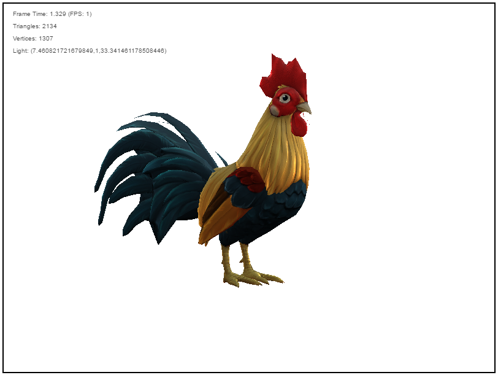

# TeapotRenderer
Baby's first software renderer (Expect poor performance).

### Features
* Triangle rasterization
* Perspective correct vertex attribute interpolation
* Per pixel depth sorting
* Texture mapping
* Wavefront OBJ parsing
* Automatic vertex normal generation.
* Normal mapping
* Blinn Phong shading

